# 🐶 WuffChat Backend (dogbot-agent)

WuffChat gibt deinem Hund eine Stimme! 

An empathetic AI chatbot that helps dog owners understand their dog's behavior from the dog's perspective — powered by GPT-4, Weaviate vector database, and a clean FSM-based conversation flow.

```mermaid
graph LR
    A[🧑 Human describes<br/>dog behavior] --> B[🤖 AI analyzes with<br/>Weaviate + GPT-4]
    B --> C[🐕 Response from<br/>dog's perspective]
    C --> D[💡 Instinct diagnosis<br/>+ training tips]
    
    style A fill:#ffe4b5
    style B fill:#e6e6fa
    style C fill:#ffd700
    style D fill:#98fb98
```



---

## 🚀 Quick Start

### Prerequisites
- Python 3.11+
- OpenAI API key
- Weaviate Cloud instance
- Redis instance (optional, for feedback storage)

### Local Setup
```bash
git clone https://github.com/kemperfekt/dogbot-agent.git
cd dogbot-agent
python3 -m venv .venv
source .venv/bin/activate
pip install -r requirements.txt
```

### Environment Variables
Create a `.env` file or set these environment variables:
```bash
# Required
OPENAI_APIKEY=sk-...              # Your OpenAI API key
WEAVIATE_URL=https://...          # Your Weaviate Cloud URL
WEAVIATE_API_KEY=...              # Your Weaviate API key

# Optional
REDIS_URL=redis://...             # Redis for feedback storage
LOG_LEVEL=INFO                    # Logging level
```

### Start the API
```bash
# V2 (production-ready - clean FSM architecture)
python -m uvicorn src.v2.main:app --port 8000

# V1 (legacy - deprecated)
python -m uvicorn src.main:app --port 8000
```

➡️ API docs: [http://localhost:8000/docs](http://localhost:8000/docs)

---

## 🧪 Testing

### Running Unit Tests
```bash
# Run all tests
pytest

# Run with coverage
pytest --cov=src --cov-report=html

# Run specific test file
pytest tests/v2/agents/test_dog_agent.py
```

**Test Status**: ✅ 119 tests passing, 61 skipped (integration tests)

### API Testing with Postman

We provide comprehensive API tests using Postman:

1. Import the test files:
   - `tests/postman/postman_collection.json`
   - `tests/postman/postman_environment.json`

2. Select "WuffChat V2 Local" environment

3. Run tests:
   - **Happy Path**: Complete conversation flow
   - **Edge Cases**: Error handling & validation
   - **Debug Endpoints**: V2-specific monitoring

---

## 🔄 How It Works

### Conversation Flow


### Architecture (V2)

```mermaid
graph TB
    subgraph "Frontend"
        UI[React App]
    end
    
    subgraph "API Layer"
        API[FastAPI<br/>src.v2.main]
    end
    
    subgraph "Orchestration"
        ORCH[V2Orchestrator]
        FSM[FlowEngine<br/>State Machine]
        HAND[FlowHandlers]
    end
    
    subgraph "Agents"
        DOG[🐕 DogAgent<br/>Dog perspective]
        COMP[💬 CompanionAgent<br/>Feedback collection]
    end
    
    subgraph "Services"
        WV[WeaviateService<br/>Vector search]
        GPT[GPTService<br/>Text generation]
        REDIS[RedisService<br/>Feedback storage]
        PM[PromptManager<br/>Centralized prompts]
    end
    
    subgraph "External"
        OPENAI[OpenAI GPT-4]
        WEAVIATE[(Weaviate<br/>Vector DB)]
        REDISDB[(Redis<br/>Cache)]
    end
    
    UI -->|HTTP| API
    API --> ORCH
    ORCH --> FSM
    FSM --> HAND
    
    HAND --> DOG
    HAND --> COMP
    
    DOG --> PM
    DOG --> GPT
    DOG --> WV
    
    COMP --> REDIS
    
    GPT --> OPENAI
    WV --> WEAVIATE
    REDIS --> REDISDB
    
    style DOG fill:#ffd700
    style COMP fill:#87ceeb
    style FSM fill:#98fb98
```



### Request Flow Example

```mermaid
sequenceDiagram
    participant User
    participant API
    participant Orchestrator
    participant FlowEngine
    participant DogAgent
    participant Weaviate
    participant GPT-4
    
    User->>API: POST /flow_intro
    API->>Orchestrator: start_conversation()
    Orchestrator->>FlowEngine: process_event(start_session)
    FlowEngine->>DogAgent: handle_greeting()
    DogAgent-->>User: "Hallo! Erzähl mal..."
    
    User->>API: POST /flow_step<br/>"Mein Hund bellt..."
    API->>Orchestrator: handle_message()
    Orchestrator->>FlowEngine: process_user_input()
    FlowEngine->>Weaviate: search symptoms
    Weaviate-->>FlowEngine: matching behaviors
    FlowEngine->>DogAgent: generate_response()
    DogAgent->>GPT-4: generate perspective
    GPT-4-->>DogAgent: dog perspective text
    DogAgent-->>User: "Als Hund fühle ich..."
```



---

## 📁 Project Structure
```
dogbot-agent/
├── src/
│   ├── main.py              # V1 API (production)
│   └── v2/                  # V2 clean architecture
│       ├── main.py          # V2 API
│       ├── agents/          # Message formatting
│       ├── core/            # Flow engine & orchestration
│       ├── prompts/         # Centralized prompts
│       └── services/        # Business logic
├── tests/
│   └── postman/             # API test collection
└── requirements.txt
```

---

## 🔍 Key Endpoints

### Core Flow
- `POST /flow_intro` - Start new conversation
- `POST /flow_step` - Send message & receive response

### V2 Debug Endpoints
- `GET /v2/health` - Detailed health check
- `GET /v2/session/{id}` - Session information
- `GET /v2/debug/flow` - FSM state information
- `GET /v2/debug/prompts` - Loaded prompts info

---

## 🗄️ Data Sources

### Weaviate Collections


- **Symptome**: Dog behaviors and symptoms
- **Instinkte**: Four core instincts (Jagd, Rudel, Territorial, Sexual)
- **Erziehung**: Training exercises
- **Allgemein**: General information
- **Instinktveranlagung**: Instinct predispositions

### Services Used
- **OpenAI GPT-4**: Natural language generation
- **Weaviate Query Agent**: Semantic search in knowledge base
- **Redis**: Feedback storage with GDPR-compliant expiration

---

## 🚢 Deployment


**V2 Status**: Production-ready with complete test coverage

**Migration Status**:
- ✅ V2 development complete
- ✅ All tests passing (119 tests)
- ✅ Error handling implemented 
- ✅ Postman collection verified
- 🔄 **Next**: Deploy to Scalingo production

**Deployment Steps**:
1. ✅ Test V2 locally with Postman collection
2. 🔄 Deploy V2 to Scalingo
3. 🔄 Update frontend to use V2 endpoints
4. 🔄 Switch production traffic to V2

---

## 📚 Related Repositories
- 🎨 **Frontend** (React): [github.com/kemperfekt/dogbot-ui](https://github.com/kemperfekt/dogbot-ui)
- 📊 **Data & Weaviate**: [github.com/kemperfekt/dogbot-ops](https://github.com/kemperfekt/dogbot-ops)
- 🏠 **Project Overview**: [github.com/kemperfekt/dogbot](https://github.com/kemperfekt/dogbot)

---

## 🤝 Contributing

1. Create a feature branch from `main`
2. Make your changes
3. Run tests: `pytest`
4. Run the Postman test collection
5. Submit a PR with description of changes

### Development Commands
```bash
# Setup environment
python3 -m venv .venv
source .venv/bin/activate
pip install -r requirements.txt
pip install -r requirements-dev.txt

# Run tests
pytest -v

# Start V2 API
python -m uvicorn src.v2.main:app --port 8000 --reload
```

---

## 📝 License

see License

---
